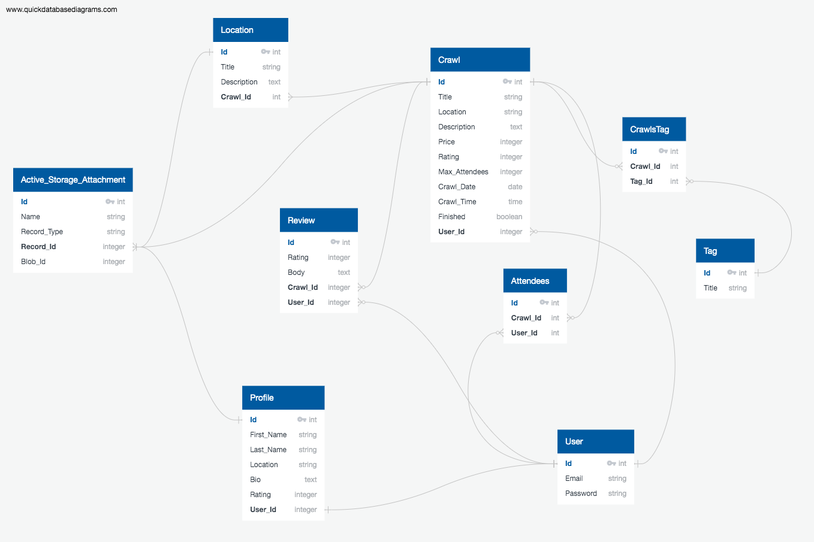

# Culture Crawl

Website: https://culturecrawl.herokuapp.com/

GitHub: https://github.com/rmar8138/Culture_Crawl

Culture Crawl is a two-sided marketplace built on Ruby on Rails for the Coder Academy Fast Track Bootcamp.

## Table of Contents

1. [Purpose](#purpose)
2. [Tech Stack](#tech-stack)
3. [Features/Functionality](#features-functionality)
4. [High Level Components](#high-level-components)
5. [User Stories](#user-stories)
6. [Sitemap](#sitemap)
7. [Screenshots](#screenshots)
8. [Wireframes](#wireframes)
9. [Database Schema/ERD](#database-schema)
10. [Models](#models)
11. [Database Relations](#database-relations)
12. [Task Tracking](#task-tracking)
13. [Third Party Services](#third-party-services)

## Purpose

Culture Crawl connects people who are passionate about discovering different cultures with people who are passionate about sharing their knowledge on these cultures. These passionate people are able to share knowledge not only of their cultural heritage, but the culture of the things that matter most to them outside that. For example, one might be interested in sharing knowledge about the photography culture in their area, or the architectural culture in their area, or maybe even the vintage watch or vintage records culture.

The app is targeted to not only those with a focused interest on niche communities and cultures, but to the wider audience in general. A user who has zero knowledge on design may sign up for a design-themed crawl, and can learn something that they may not have ever had the chance to learn, from someone who is well versed in that sphere. Culture Crawl aims to facilitate a cultural exchange, which is open to everyone who wishes to partake.

## Tech Stack

- Ruby on Rails
- HTML + CSS (ERB + Sass)
- JavaScript
- Stripe (Payments)
- AWS S3 (Image hosting)
- Heroku (Deployment)

## Features/Functionality

Every one knows what a pub crawl is, but a culture crawl takes it to a different level where passionate experts of these different cultures are able to guide like-minded and interested individuals in their own curated walk, or 'crawl' throughout their own town's hottest locations. Users are able to sign up and create these crawls that relate to whatever it is they are passionate about or feel connected to, and other users are able to book these crawls and experience a view of culture that they may not otherwise be able to experience. After the crawl, those who attended are able to leave a review and a score up to 5. These reviews are then aggregated and a score is assigned to the crawl, which then contributes to the overall score of the user who uploaded the crawl. This rating system allows users to see which users offer the best experiences.

While there are similar services that offer tour guide experiences, Culture Crawl aims to differentiate itself by focusing solely on niche, curated areas of interests and bridge the gap between different communities and different cultures.

Further functionality and features to be implemented are:

- Airbnb style listing
- Google maps integration
- Community pages
- Highest rated crawls
- Private messaging

**Airbnb style listing**

Currently, due to time constraints and complexity, the app functions more in a 'Meetup' style, where users post a crawl on a certain date, and when that date passes, the crawl is then marked as finished, which is when reviews can be made. A more practical solution to this would be to integrate more of an 'Airbnb' style listing, in which users can upload crawls as 'templates' which can then be offered on multiple dates, in regularity or irregularity. This stops the user from having to constantly create crawls that they have previously done, and allow a more rigorous review system for the specific crawl, as reviews will be left on the crawl template themselves.

**Google maps integration**

A client side feature that will be implemented in the future is the use of Google Maps API, wherein users who upload crawls can select locations via Google Maps, which is then saved to the database as a geolocation. A crawl route can then be traced which is displayed on the page which can then show users a more detailed route of the crawl. This feature can be seen in the initial wireframes.

**Community Pages**

Community pages allow crawls to belong to certain communities, which allow for a better user experiences in terms of searching, creating and discussing crawls. For example, there could be a 'music' community page which will feature all the music-related crawls, and highlight the best crawls in that category. In addition to this, users can also interact with each other openly here, and create posts and comments, and discuss about certain crawls and perhaps talk about future crawls that either exist or don't. Whether these community pages are admin or user created is still undecided.

**Highest rated crawls**

This is a feature that would be implemented following the Airbnb style listing feature, where the highest ratet crawls would be featured on the home page, as well as in each community page.

**Private messaging**

This is of course a crucial feature, which allows users to privately message each other in real time. Users would be able to interact with their hosts about the nature of the crawls, and ask any relevant questions pertaining to the crawl.

## High Level Components

The two main high level components of the app are the User, and the Crawl.

The User represents both the person trying to offer their services as a knowledgeable tour guide, as well as the person who is keen on embarking on a cultural experience. As such, the user is able to sign up and book for crawls, as well as create and manage their own. These users have profiles, which will have information about themselves, such as a profile image, name, location, and a short bio about themselves. The users who maintain crawls will also have a rating assigned to them, based on the aggregation of all reviews made on their previous crawls.

The Crawl is the representation of the product being sold, or in this case, the service being exchanged. This crawl will have specific information, such as the maximum number of people who can attend, and the price per person, which is set by the user maintaining the crawl. In addition, the crawl will also hold general informtation, such as a title, image, location and a description. The crawl itself will also have an itinerary, which is built on multiple locations upon which the crawl is comprised of.

The interaction between these two components is as such. A user can create, edit or delete a crawl, as well as book a crawl. When a crawl is finished, all users who have attended the crawl (attendees) are required to leave a review, and a rating based on how they felt about the experience. This review is able to be seen and read by other users, and serves as a score to represent the user who hosted the crawl.

## User Stories

> As a non-user, I want to be able to view all crawls without needing to sign up, so I can see first if there is anything interesting.

> As a user, I want to be able to edit my profile if my details change.

> As a user, I want to be able to create and manage crawls so I can host them to other users.

> As a user, I don't want anyone to be able to edit my profile or crawls for security reasons.

> As a past attendee, I want to be able to leave a review after attending the crawl so I can tell others my experience.

> As a user, I shouldn't be able to view the booking page or pay for anything without having an account first, as I need an account to manage and view the crawls I am attending.

> As a user, I shouldn't have to see the booking button for a crawl that I made, as it doesn't make sense to pay for a crawl that I am hosting.

> As a user, I shouldn't be able to review a crawl that I hosted, as I could leave biased reviews to boost my ratings.

## Sitemap

The following is a sitemap of the site as of the latest commit.

## Screenshots

**Home Page**

**Profile Page**

**Crawl Page**

**Confirm Booking Page**

**New Crawl Page**

**Register Page**

**Login Page**

## Wireframes

A link to the wireframes can be found [here](resources/wireframes/culture-crawl-wireframes.pdf).

## Database Schema/ERD

The ERD that was conceived during the wireframing/prototyping process slightly differs to the final ERD as of the latest commit. The prototype contains a feature that does not currently exist, the tags feature, which was meant to be a way to categorise and search crawls, but was ommitted due to time constraints.

**Prototype ERD**

**Final ERD**

## Models

The models that are in use in the Culture Crawl app are as follows:

- User
- Profile
- Crawl
- Location
- Review
- Attendee

**User Model**

The User model is responsible for the general tracking of user to data info, and is related to many of the other models. The User model has a has_one relationship to the Profile model, and a has_many relationship to the Crawl, Attendee and Review models. The separation of the User and the Profile model was done to separate login information with personal profile information, which is not necessary during the login phase.

The User model has a has_many relationship with the Crawl model as a single user is able to create and maintain multiple crawls at a single time. A User can have many Attendees (the attendee signifies a user is attending a crawl) as a single User can attend multiple crawls at a time. And finally, the User can have many Reviews, as they can write reviews for the multiple crawls they have attended.

The User model is also authenticated with Devise.

**Profile Model**

The Profile model is responsible for holding the general personal information about a User, such as their name, address, biography etc. The Profile maintains a belongs_to relationship with the User model. The Profile model also has a has_one_attached relationship to a profile_image, which is saved on the active_storage table.

**Crawl Model**

The Crawl model is responsible for maintaining information relating to a crawl, such as the title, location, description, date, price, max attendees and itinerary. It has a belongs_to relationship with the User model, and a has_many relationship with the Location, Attendee and Review model.

The Crawl model has multiple user-uploaded locations, which are handled by the Location model and builds up the crawl's itinerary. The Crawl model has a has_many relationship with the Attendee model, as multiple attendees can be present at the one crawl. Finally, the Crawl model has a has_many relationship with the Review model, as a single crawl can have multiple reviews by multiple users.

The Crawl model also has a has_one_attached relationship to a crawl_image, which is saved on the active_storage table.

**Location Model**

The Location model is responsible for holding information about individual locations of a crawl's itinerary, such as the title, location name and description. The Location model maintains a belongs_to relationship with the Crawl model.

The Location model also has a has_one_attached relationship to a location_image, which is saved on the active_storage table.

**Review Model**

The Review model is responsible for handling information about user reviews on a crawl, such as the review title, rating, and body. The Review model has a belongs_to relationship with both the User model and the Crawl model.

**Attendee Model**

The Attendee model is responsible for holding information about which user is attending which crawl, and has a belongs_to relationship with both the User model and the Crawl model.

## Database Relations

The tables present in the Culture Crawl database are as follows:

- User
- Profile
- Crawl
- Location
- Review
- Attendee
- Active_Storage

The relationships that these tables have with each other can both be viewed in the ERD diagram, as well as in the discussion of the models in the section above.

The Review and Attendee tables are both join tables that join the User and the Crawl tables. The Attendees table simply takes in the user_id and crawl_id foreign keys to keep track of which users are attending which crawls, and the Review table takes extra columns in order to store a user review on a crawl.

The Active_Storage table is used to track uploaded images of profiles, crawls and locations. These are represented in the Models themselves through the has_one_attached relationship.

## Task Tracking

Task tracking for this project was done through a trello board, which proved to be immensely helpful in determining what tasks needed to be completed, the priority of these tasks, and motivation in terms of watching the completed list pile up.

Here is what the trello board looked upon initial completion:

The card stacks were divided into Backlog, In Progress and Completed. When a feature was waiting to be worked on, it sat in the backlog pile. When it was being worked on, it was in progress, and of course after completion it moved to the completed pile.

There were several Backlog piles in order to differentiate the different tasks that needed to be completed. I implemented a Backend Backlog for the Rails side of things, such as working with the Database and MVC architecture. The Frontend Backlog related to more styling features, using CSS and Sass. The Documentation Backlog contained everything that needed to be compeleted for the assignment in terms of documentation, such as the different components of the README.md file and the slide deck/presentation. Finally, there was a Stretch Goals Backlog which contained tasks that were to be implemented if there was time.

Halfway through the assignment, I added a Errors Backlog which housed all the different issues and bugs that I would encounter throughout the making of the app. These issues and bugs would oftentimes pop up in multiples, which made everything easier to track when placed in a trello deck, which I could then return to every so often and work through.

## Third Party Services

The following third party services were implemented in the making of this app:

- Stripe
- AWS S3
- Devise
- Cocoon
- Faker/Down
- Kaminari
- Datetime_picker/Bootstrap

**Stripe**

Stripe is what handles all payment requests for Culture Crawl. Rather than attempt to implement my own payment system (bad idea), it was much easier to lean on Stripe's developer-friendly API to process transactions. When users book a crawl, they are taken outside of the app to a Stripe gateway where they can securely enter their payment info. The app makes use of this to track payments, and on top of this the app uses Stripe's webhook feature to safely and securely ensure payment and notice of payment regardless of internet connection.

**AWS S3**

AWS S3 is used to host all images uploaded by users. Uploading images to a cloud service proved to be much more manageable and scaleable than saving the images locally to disk for obvious reasons.

**Devise**

Devise was used for user authentication, authorization and registration tasks. The only model that uses devise is the User model. There were a few modificaioins made to the stock devise setup, such as adding a custom registrations controller in order to redirect users to the new profile form page right after user creation (Users and Profiles are separate models/tables).

**Cocoon**

The Cocoon gem proved to be a good help in terms of saving multiple Locations to a Crawl, each as a separate Location record in the database. Cocoon provided a simple way to add custom fields dynamically using jQuery, as well as saving these fields as separate instances. This was exactly what I needed, as a Crawl has multiple locations, but these locations are stored in their own Locations table separate to the Crawl table.

**Faker/Down**

Both the Faker and the Down gems proved invaluable in the development process of the app by providing fake data, as well as a simple downloading feature for images, which was used extensively in the seeds file.

**Kaminari**

The Kaminari gem is a pagination gem which took a lot of the manual work out of creating pagination. It provides a very simple to use API for querying specific amounts of records through the model, and is highly customiseable. Furthermore, it adds very useful view helpers such as pagination links which are incredibly useful, and are implemented in the crawls page.

**Datetime_picker/Bootstrap**

The Datetime_picker gem is a plugin which provides a bootstrap style date and time picker, which was a step up from the stock select_datetime form helper provided by rails. This is used in the new and edit crawls page in order to save the crawl_date as a datetime object in the database. Bootstrap also had to be installed in order for this to work.
